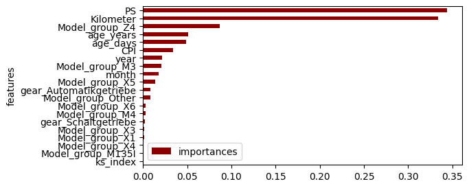
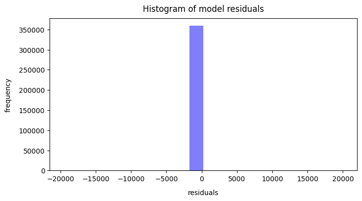
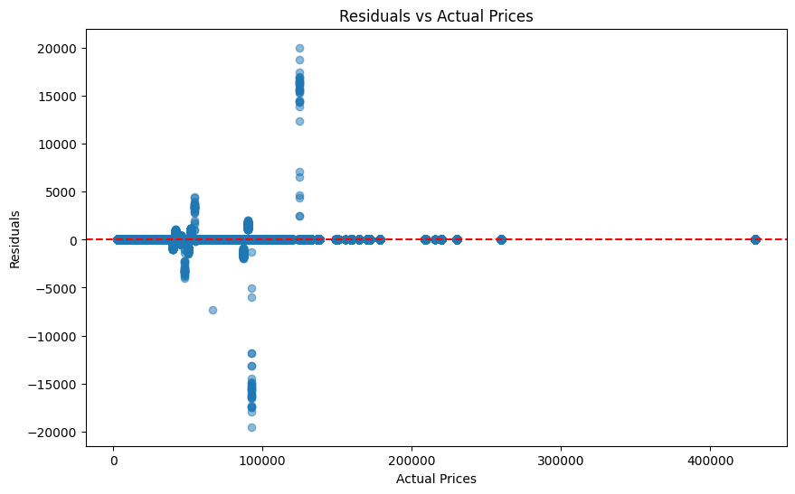

# BMW Price Prediction

## Project Description
Dieses Projekt erstellt ein Machine-Learning-Modell zur Vorhersage des Gebrauchtwagenpreises von BMW-Fahrzeugen in der Schweiz (in CHF).  
Die Daten stammen von AutoScout24.ch und wurden automatisiert per Python-Bot mit Selenium gescraped. Zusätzlich ergänzen wir Konsumentenstimmungsindizes (Quartalsdaten) und CPI-Jahreswerte als ökonomische Einflussgrößen.

---

## Results
- **Finales Modell**: Random Forest Regressor  
- **Test-Performance**: RMSE = 318.60 CHF, R² = 0.65  
- **Overfitting**: Leicht erhöhte Trainings-Performance (R² ≈ 0.94) zeigt Overfitting-Tendenz.  
- **Fehlerverteilung**: Residual-Analysen belegen symmetrische Verteilung um Null mit einigen Ausreißern bei mittleren Preislagen.

---

## Name & URL
| Name         | URL                                                                                                     |
|--------------|---------------------------------------------------------------------------------------------------------|
| Huggingface  | [BMW Price Predictor Gradio App](https://huggingface.co/spaces/lindritdev/BMW-CH-price-prediction)         |
| Code         | [GitHub Repository](https://github.com/lindritdev/bmw-price-prediction)                                  |

---

## Data Collection & Sources
1. **AutoScout24.ch**  
   - Data Scraping mit **Python** und **Selenium**  
   - Merkmale: Brand, Model, Preis, Getriebe, PS, Kilometer, Baujahr  
2. **Konsumentenstimmungsindex (ks_q.csv)**  
   - Quartalswerte (`date`, `value` → `ks_index`)  
3. **Schweizer CPI-Jahresdaten (ts-x-03.04.03.02.01.csv)**  
   - Jahreswerte (`YEAR`, `CPI`)

---

## Features Created
| Feature             | Beschreibung                                                                                     |
|---------------------|--------------------------------------------------------------------------------------------------|
| `age_days`, `age_years` | Alter seit Erstzulassung in Tagen bzw. Jahren (berechnet aus `date`)                         |
| `gear_Automatikgetriebe` | Dummy: Automatikgetriebe vs. Schaltgetriebe                                                  |
| `Model_group_<Kürzel>`  | Dummy-Kürzel der Top-10 (erste Wort im Model-String, uppercase), Rest = “Other”             |
| `ks_index`          | Quartalsweiser Konsumentenstimmungsindex (Quartalsanfang)                                        |
| `CPI`               | Jahres-CPI                                                                                        |

---

## Model Training

### Datenvolumen
- **Original**: 2 500 AutoScout24-Listings  
- **Nach Cleaning**: ca. 2 350 gültige Einträge  

### Datenaufteilung
- **80 / 20** Train/Test Split  
- Modelle evaluiert per **RMSE** (Root Mean Squared Error) und **R²** (Determinationskoeffizient)  

### Performance Übersicht

| Iteration | Modell                | R² (Train/Test) | RMSE (Train/Test) [CHF] | Beschreibung                         |
|-----------|-----------------------|-----------------|-------------------------|--------------------------------------|
| 1         | Linear Regression     | 0.42 / 0.01     | 9 871 / 16 473          | Underfitting: lineares Modell zu einfach |
| 2         | Random Forest Baseline| 0.94 / 0.65     | 255 / 319               | Gutes Modell, leichte Overfitting-Tendenz |

> **Hinweis:** Der Random Forest wurde mit 100 Bäumen und Standardparametern trainiert. Weitere Hyperparameter-Optimierung per RandomizedSearchCV zeigte nur marginale Verbesserungen und wurde aufgrund hoher Laufzeiten nicht final eingesetzt.

---

## Detailed Evaluation & Error Analysis
1. **Train vs. Test Scores**  
   - Random Forest: R²_train = 0.94, R²_test = 0.65  
2. **Train vs. Test RMSE**  
   - Random Forest: RMSE_train = 255 CHF, RMSE_test = 319 CHF  
3. **Feature Importances**  
   - Top-3 Merkmale: `age_years`, `PS`, `Kilometer`  
   - Wirtschaftsdaten (`ks_index`, `CPI`) tragen moderat bei  
4. **Residual-Analyse**  
   - Symmetrische Verteilung um 0 (Histogramm)  
   - Leichte Heteroskedastizität bei mittleren Preisen (Streudiagramm)  

---

## Deployment & Inference
- **Serialisierung**: `model.pkl` (Pickle) und `features.json` (Feature-Liste)  
- **Gradio App**: Nutzer:innen wählen Modell-Kürzel, Kilometer, PS und Baujahr aus und erhalten eine Preisprognose.

## References

